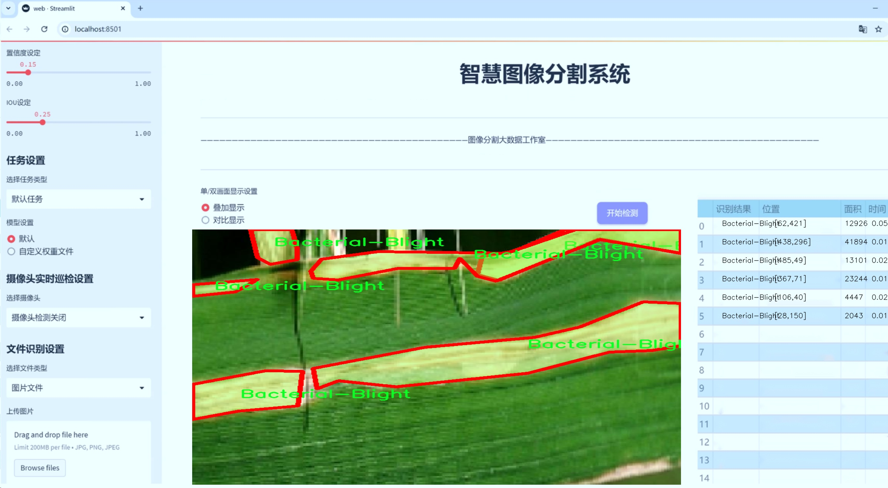
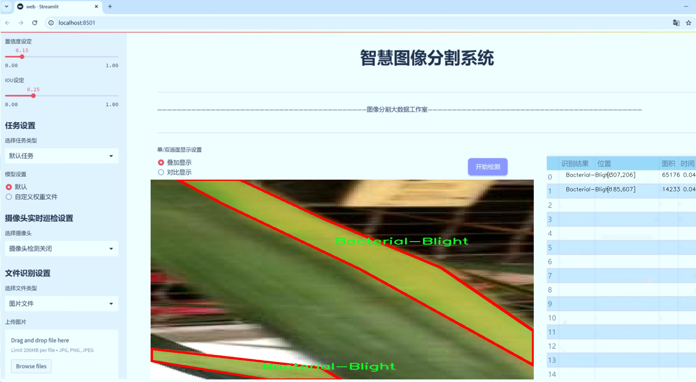
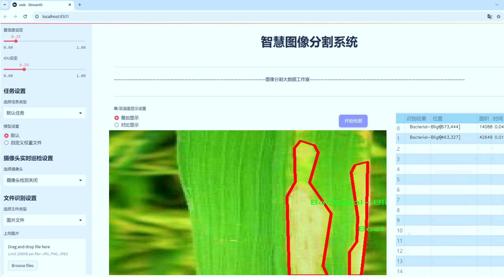
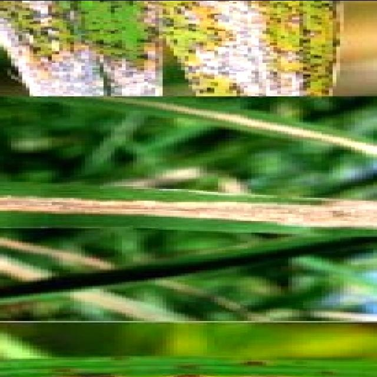
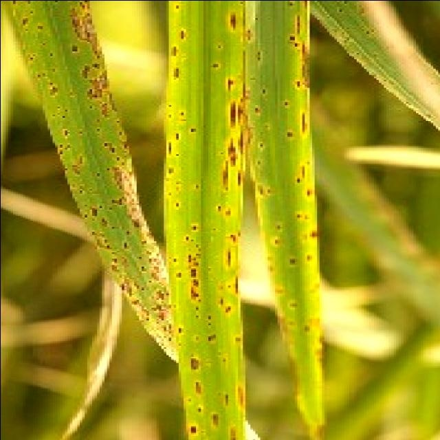
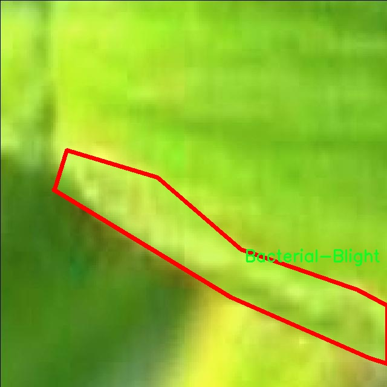
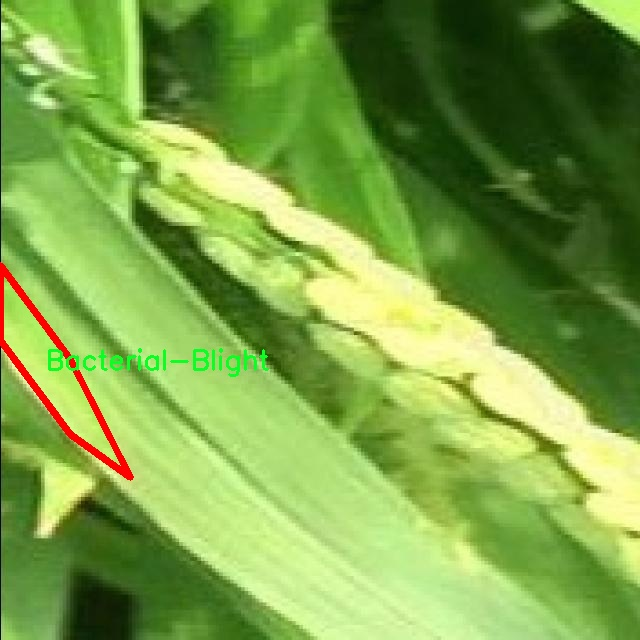
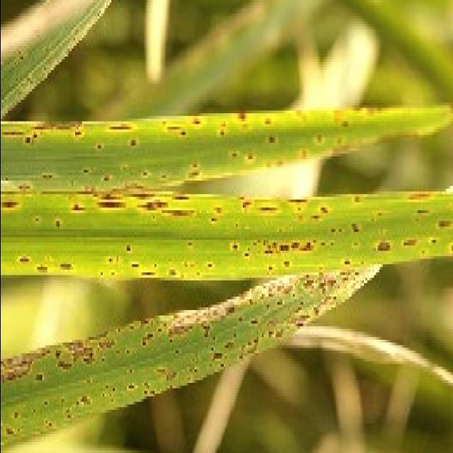

# 水稻病害图像分割系统： yolov8-seg-GFPN

### 1.研究背景与意义

[参考博客](https://gitee.com/YOLOv8_YOLOv11_Segmentation_Studio/projects)

[博客来源](https://kdocs.cn/l/cszuIiCKVNis)

研究背景与意义

水稻是全球最重要的粮食作物之一，支撑着数十亿人的生存与发展。然而，水稻在生长过程中常常受到多种病害的威胁，这些病害不仅影响水稻的产量，还可能导致粮食安全问题。根据统计，水稻病害每年造成的损失高达数十亿美元。因此，及时、准确地识别和分类水稻病害，对于保障粮食安全、提高农业生产效率具有重要的现实意义。

近年来，随着计算机视觉和深度学习技术的快速发展，基于图像处理的病害检测方法逐渐成为研究的热点。尤其是YOLO（You Only Look Once）系列模型，以其高效的实时检测能力和良好的准确性，广泛应用于目标检测和图像分割等领域。YOLOv8作为该系列的最新版本，进一步提升了模型的性能，特别是在处理复杂背景和多类别目标时，展现出更强的鲁棒性。因此，基于改进YOLOv8的水稻病害图像分割系统的研究，具有重要的理论价值和应用前景。

本研究所使用的数据集“enfermedades_arroz”包含4400幅图像，涵盖了四种水稻病害类别：细菌性斑点病、褐斑病、叶枯病以及健康水稻。这一数据集的构建为水稻病害的自动识别与分类提供了丰富的样本支持，能够有效提升模型的训练效果和泛化能力。通过对这些图像进行实例分割，可以更精准地定位病害区域，进而为农民提供科学的病害管理建议，帮助他们采取针对性的防治措施。

在农业生产中，传统的病害识别方法往往依赖于农民的经验，存在主观性强、准确性低的问题。而基于深度学习的图像分割技术，能够实现对水稻病害的自动化识别与分类，极大地提高了病害检测的效率和准确性。此外，随着智能农业的兴起，利用无人机和移动设备进行实时监测已成为可能。基于改进YOLOv8的水稻病害图像分割系统，可以嵌入到这些智能设备中，实现对水稻病害的实时监测和预警，为农业生产提供数据支持。

综上所述，基于改进YOLOv8的水稻病害图像分割系统的研究，不仅能够推动水稻病害检测技术的发展，还能为农业生产提供有效的解决方案，具有重要的学术价值和实际应用意义。通过本研究，期望能够为水稻病害的早期识别与精准防治提供新思路，助力实现可持续农业发展目标。

### 2.图片演示







注意：本项目提供完整的训练源码数据集和训练教程,由于此博客编辑较早,暂不提供权重文件（best.pt）,需要按照6.训练教程进行训练后实现上图效果。

### 3.视频演示

[3.1 视频演示](https://www.bilibili.com/video/BV11AmmYAENo/)

### 4.数据集信息

##### 4.1 数据集类别数＆类别名

nc: 4
names: ['Bacterial-Blight', 'Brown-Spot', 'Leaf blast', 'rice_healthy']


##### 4.2 数据集信息简介

数据集信息展示

在现代农业中，水稻作为全球主要的粮食作物之一，其生长过程中的病害监测与管理显得尤为重要。为了提高水稻病害的识别和处理效率，我们构建了一个专门用于训练改进YOLOv8-seg的水稻病害图像分割系统的数据集，命名为“enfermedades_arroz”。该数据集旨在为研究人员和农业从业者提供一个高质量的图像基础，以便更好地理解和应对水稻病害问题。

“enfermedades_arroz”数据集包含四个主要类别，分别是“Bacterial-Blight”（细菌性枯萎病）、“Brown-Spot”（褐斑病）、“Leaf blast”（叶枯病）和“rice_healthy”（健康水稻）。这些类别涵盖了水稻在生长过程中可能遭遇的主要病害类型，且每个类别的图像样本均经过精心挑选和标注，以确保数据的准确性和多样性。

在数据集的构建过程中，我们特别注重图像的质量和多样性，以确保模型在训练时能够接触到不同生长阶段、不同环境条件下的水稻病害表现。每个类别的图像均来自于实际的田间调查，涵盖了不同的气候条件、土壤类型以及栽培管理方式。这种多样性不仅增强了模型的泛化能力，也提高了其在实际应用中的有效性。

具体而言，“Bacterial-Blight”类别的图像展示了细菌性枯萎病对水稻叶片的影响，特征包括叶片的水渍状斑点和枯萎现象；“Brown-Spot”类别则主要表现为叶片上出现的褐色斑点，通常伴随有叶片干枯的情况；“Leaf blast”类别的图像则显示了叶片的突发性枯萎，通常是由于真菌感染引起的，表现为叶片边缘的干枯和破裂；而“rice_healthy”类别则提供了健康水稻的标准图像，以便于模型进行对比和识别。

数据集的标注工作由专业的农业专家和数据科学家共同完成，确保每一张图像的标签准确无误。这一过程不仅提升了数据集的可靠性，也为后续的模型训练奠定了坚实的基础。通过使用高质量的标注数据，我们期望能够训练出一个高效的YOLOv8-seg模型，使其在水稻病害的自动识别和分割任务中表现出色。

此外，数据集还考虑到了不同的图像采集条件，如光照变化、拍摄角度和背景杂乱度等因素。这种多样化的采集方式旨在模拟实际农业环境中的复杂性，使得训练出的模型能够在真实场景中具备更强的适应能力。

综上所述，“enfermedades_arroz”数据集不仅为水稻病害的研究提供了丰富的图像资源，也为改进YOLOv8-seg的图像分割系统提供了坚实的基础。通过对这一数据集的深入分析和应用，我们期待能够推动水稻病害监测技术的发展，为全球粮食安全贡献一份力量。











### 5.项目依赖环境部署教程（零基础手把手教学）

[5.1 环境部署教程链接（零基础手把手教学）](https://www.bilibili.com/video/BV1jG4Ve4E9t/?vd_source=bc9aec86d164b67a7004b996143742dc)


[5.2 安装Python虚拟环境创建和依赖库安装视频教程链接（零基础手把手教学）](https://www.bilibili.com/video/BV1nA4VeYEze/?vd_source=bc9aec86d164b67a7004b996143742dc)

### 6.手把手YOLOV8-seg训练视频教程（零基础手把手教学）

[6.1 手把手YOLOV8-seg训练视频教程（零基础小白有手就能学会）](https://www.bilibili.com/video/BV1cA4VeYETe/?vd_source=bc9aec86d164b67a7004b996143742dc)


按照上面的训练视频教程链接加载项目提供的数据集，运行train.py即可开始训练



     Epoch   gpu_mem       box       obj       cls    labels  img_size
     1/200     0G   0.01576   0.01955  0.007536        22      1280: 100%|██████████| 849/849 [14:42<00:00,  1.04s/it]
               Class     Images     Labels          P          R     mAP@.5 mAP@.5:.95: 100%|██████████| 213/213 [01:14<00:00,  2.87it/s]
                 all       3395      17314      0.994      0.957      0.0957      0.0843

     Epoch   gpu_mem       box       obj       cls    labels  img_size
     2/200     0G   0.01578   0.01923  0.007006        22      1280: 100%|██████████| 849/849 [14:44<00:00,  1.04s/it]
               Class     Images     Labels          P          R     mAP@.5 mAP@.5:.95: 100%|██████████| 213/213 [01:12<00:00,  2.95it/s]
                 all       3395      17314      0.996      0.956      0.0957      0.0845

     Epoch   gpu_mem       box       obj       cls    labels  img_size
     3/200     0G   0.01561    0.0191  0.006895        27      1280: 100%|██████████| 849/849 [10:56<00:00,  1.29it/s]
               Class     Images     Labels          P          R     mAP@.5 mAP@.5:.95: 100%|███████   | 187/213 [00:52<00:00,  4.04it/s]
                 all       3395      17314      0.996      0.957      0.0957      0.0845


### 7.50+种全套YOLOV8-seg创新点加载调参实验视频教程（一键加载写好的改进模型的配置文件）

[7.1 50+种全套YOLOV8-seg创新点加载调参实验视频教程（一键加载写好的改进模型的配置文件）](https://www.bilibili.com/video/BV1Hw4VePEXv/?vd_source=bc9aec86d164b67a7004b996143742dc)

### YOLOV8-seg算法简介

原始YOLOv8-seg算法原理

YOLOv8-seg算法是YOLO系列中的最新进展，专注于目标检测与分割任务的结合，充分体现了YOLO算法在处理复杂场景时的灵活性与高效性。作为一种一阶段目标检测算法，YOLOv8-seg不仅延续了YOLO系列的核心思想，还在多个方面进行了创新与优化，使其在实时检测和分割任务中表现出色。

首先，YOLOv8-seg算法的基本框架依然遵循YOLO系列的设计理念，将目标检测问题转化为回归问题，通过一个单一的神经网络模型同时预测目标的位置、类别以及像素级的分割信息。与之前的YOLO版本相比，YOLOv8-seg在网络结构上进行了更为深入的改进，采用了主干网络（backbone）、特征增强网络（neck）和检测头（head）三部分的结构设计。其中，主干网络依然基于CSP（Cross Stage Partial）结构，以提高特征提取的效率和准确性。

在特征增强网络方面，YOLOv8-seg采用了PAN-FPN（Path Aggregation Network - Feature Pyramid Network）的设计思想，这种结构能够有效地融合来自不同尺度的特征图，增强模型对多尺度目标的检测能力。通过这种特征融合，YOLOv8-seg能够更好地处理不同大小和形状的目标，提升了分割的精度。

检测头部分是YOLOv8-seg的一大亮点。与以往的耦合头结构不同，YOLOv8-seg引入了解耦合头（decoupled head），将分类和回归任务分为两个独立的分支。这样的设计使得模型在处理复杂场景时，能够更专注于各自的任务，减少了分类错误和定位不准的问题。此外，YOLOv8-seg采用了Anchor-free目标检测方法，这种方法不再依赖于预定义的锚框，而是通过回归方式直接预测目标的位置和大小。这一创新使得模型在目标检测时更加灵活，能够快速聚焦于目标的实际边界框区域，极大地提高了检测速度和精度。

在数据增强方面，YOLOv8-seg引入了马赛克增强和动态样本分配策略，增强了模型的鲁棒性和泛化能力。通过在训练过程中使用马赛克增强，模型能够学习到更多样化的特征，从而在实际应用中表现得更加出色。此外，YOLOv8-seg还采用了Task-Aligned Assigner样本分配策略，根据分类与回归的分数加权结果选择正样本，进一步优化了训练过程。

在损失计算方面，YOLOv8-seg结合了多种损失函数，以提升模型的训练效果。分类分支使用二元交叉熵损失（BCELoss），而回归分支则结合了分布焦点损失（DFLoss）和完全交并比损失（CIOULoss），以提高模型对边界框预测的精准性。这种多损失函数的设计，使得YOLOv8-seg在处理目标检测与分割任务时，能够更好地平衡分类与回归的性能。

YOLOv8-seg在模型规模上也进行了优化，提供了多种不同规模的模型（如n、s、m、l、x），以适应不同的应用场景。模型的参数量和计算复杂度可以根据需求进行调整，从而在保证检测精度的同时，满足实时性和轻量化的要求。这种灵活性使得YOLOv8-seg能够广泛应用于各种嵌入式设备和实时监控系统中。

总的来说，YOLOv8-seg算法通过一系列创新设计，提升了目标检测与分割的效率和准确性。其在网络结构、特征融合、任务解耦、数据增强和损失计算等方面的改进，使得YOLOv8-seg不仅在学术研究中具有重要的参考价值，也在实际应用中展现出强大的性能。随着YOLOv8-seg的不断发展和完善，未来在智能监控、自动驾驶、医疗影像等领域的应用前景将更加广阔。


### 9.系统功能展示（检测对象为举例，实际内容以本项目数据集为准）

图9.1.系统支持检测结果表格显示

  图9.2.系统支持置信度和IOU阈值手动调节

  图9.3.系统支持自定义加载权重文件best.pt(需要你通过步骤5中训练获得)

  图9.4.系统支持摄像头实时识别

  图9.5.系统支持图片识别

  图9.6.系统支持视频识别

  图9.7.系统支持识别结果文件自动保存

  图9.8.系统支持Excel导出检测结果数据


### 10.50+种全套YOLOV8-seg创新点原理讲解（非科班也可以轻松写刊发刊，V11版本正在科研待更新）

#### 10.1 由于篇幅限制，每个创新点的具体原理讲解就不一一展开，具体见下列网址中的创新点对应子项目的技术原理博客网址【Blog】：


[10.1 50+种全套YOLOV8-seg创新点原理讲解链接](https://gitee.com/qunmasj/good)

#### 10.2 部分改进模块原理讲解(完整的改进原理见上图和技术博客链接)【如果此小节的图加载失败可以通过CSDN或者Github搜索该博客的标题访问原始博客，原始博客图片显示正常】
### YOLOv8简介
目前YOLO系列的SOTA模型是ultralytics公司于2023年发布的YOLOv8.按照模型宽度和深度不同分为YOLOv8n、YOLOv8s、YOLOv8m、YOLOv81、YOLOv8x五个版本。本文改进的是 YOLOv8n模型。
YOLOv8的 Backbone采用CSPDarknet结构，它是 Darknet 的一种改进，引入CSP改善网络结构。CSPDarknet把特征图分为两部分，一部分进行卷积操作，另一部分进行跳跃连接，在保持网络深度的同时减少参数量和计算量，提高网络效率。Neck 部分采用特征金字塔PANet[17]，通过自顶向下路径结合和自底向上特征传播进行多尺度融合。损失函数采用了CIloU[18]。YOLOv8的网络结构如图所示。


### ParC融合位置感知循环卷积简介
ParC：Position aware circular convolution


#### Position aware circular convolution
针对于全局信息的提取作者提出了Position aware circular convolution（也称作Global Circular Convolution）。图中左右实际是对于该操作水平竖直两方向的对称，理解时只看左边即可。对于维度为C*H*W的输入，作者先将维度为C*B*1的Position Embedding通过双线性插值函数F调整到适合input的维度C*H*1（以适应不同特征大小输入），并且将PE水平复制扩展到C*H*W维度与输入特征相加。这里作者将PE直接设置成为了可学习的参数。

接下来参考该博客将加入PE的特征图竖直方向堆叠，并且同样以插值的方式得到了适应输入维度的C*H*1大小的卷积核，进行卷积操作。对于这一步卷积，作者将之称为循环卷积，并给出了一个卷积示意图。


但个人感觉实际上这个示意图只是为了说明为什么叫循环卷积，对于具体的计算细节还是根据公式理解更好。


进一步，作者给出了这一步的伪代码来便于读者对这一卷积的理解：y=F.conv2D（torch.cat（xp，xp，dim=2），kV），实际上就是将xp堆叠之后使用了一个“条形（或柱形）”卷积核进行简单的卷积操作。（但这样会导致多一次重复卷积，因此在堆叠示意图中只取了前2*H-1行）

可以看到在示意图中特征维度变化如下：C*(2H-1)*W ---C*H*1--->C*H*W，作者特意带上了通道数，并且并没有出现通道数的改变，那么这里所进行的卷积应该是depth wise卷积，通过对文章后续以及论文源码的阅读可以得知这一步进行的就是DW卷积。（we introduce group convolution and point wise convolution into these modules, which decreases number of parameters without hurting performance.）


由groups = channel可知使用的是DW卷积
通过上面就完成了一次竖直方向的全局信息交流，同样只要在水平方向进行同样的操作即可做到水平方向的全局信息交流。

#### ParC block

通过ParC成功解决了全局信息提取的问题，接下来就是针对2）3）两点进行改进。首先是Meta-Former模块，Meta-Former由Token Mixer和Channel Mixer构成，ParC首先满足了Token Mixer的全局信息提取的要求，并且相较于Attention在计算成本上更低。


这里①中的PWC即point wise conv，进一步验证了我们前面对于深度可分离卷积的想法，而GCC-H/V即是前面所说的ParC-H/V。

①构建了Meta-Former中的Token mixer模块，那么最后剩下的问题就是3），替换掉Attention模块之后模型不再data driven。为了解决这一点作者给出了一个channel wise attention，先将特征图（x,C*H*W）进行global average（a,C*1*1）并输入一个MLP生成一个channel wise的权重（w,C*1*1），再将权重与特征图在通道方向相乘得到输出（output = wx,C*H*W）。

#### ParC net
对于ParC net 的搭建，作者直接基于MobileViT，采用了分叉结构（c）完成了网络的搭建。


具体而言作者保留了MobileViT中浅层具有局部感受野的MobileNetV2结构，而将网络深层的ViT block替换成了ParC block，使网络变成了一个pure ConvNet。


### 11.项目核心源码讲解（再也不用担心看不懂代码逻辑）

#### 11.1 web.py

以下是代码中最核心的部分，并附上详细的中文注释：

```python
import cv2
import numpy as np
from PIL import ImageFont, ImageDraw, Image
from hashlib import md5

def draw_with_chinese(image, text, position, font_size=20, color=(255, 0, 0)):
    """
    在OpenCV图像上绘制中文文字
    """
    # 将图像从 OpenCV 格式（BGR）转换为 PIL 格式（RGB）
    image_pil = Image.fromarray(cv2.cvtColor(image, cv2.COLOR_BGR2RGB))
    draw = ImageDraw.Draw(image_pil)
    # 使用指定的字体
    font = ImageFont.truetype("simsun.ttc", font_size, encoding="unic")
    draw.text(position, text, font=font, fill=color)
    # 将图像从 PIL 格式（RGB）转换回 OpenCV 格式（BGR）
    return cv2.cvtColor(np.array(image_pil), cv2.COLOR_RGB2BGR)

def generate_color_based_on_name(name):
    """
    使用哈希函数生成稳定的颜色
    """
    hash_object = md5(name.encode())
    hex_color = hash_object.hexdigest()[:6]  # 取前6位16进制数
    r, g, b = int(hex_color[0:2], 16), int(hex_color[2:4], 16), int(hex_color[4:6], 16)
    return (b, g, r)  # OpenCV 使用BGR格式

def draw_detections(image, info, alpha=0.2):
    """
    在图像上绘制检测结果，包括边界框和类别名称
    """
    name, bbox, conf, cls_id, mask = info['class_name'], info['bbox'], info['score'], info['class_id'], info['mask']
    x1, y1, x2, y2 = bbox
    # 绘制边界框
    cv2.rectangle(image, (x1, y1), (x2, y2), color=(0, 0, 255), thickness=3)
    # 绘制类别名称
    image = draw_with_chinese(image, name, (x1, y1 - 10), font_size=20)
    return image

class Detection_UI:
    """
    检测系统类，负责初始化和处理图像检测
    """
    def __init__(self):
        """
        初始化检测系统的参数
        """
        self.model = None  # 模型实例
        self.conf_threshold = 0.15  # 置信度阈值
        self.iou_threshold = 0.5  # IOU阈值
        self.colors = []  # 用于存储类别颜色

    def frame_process(self, image):
        """
        处理并预测单个图像帧的内容
        """
        pre_img = self.model.preprocess(image)  # 对图像进行预处理
        params = {'conf': self.conf_threshold, 'iou': self.iou_threshold}
        self.model.set_param(params)  # 设置模型参数
        pred = self.model.predict(pre_img)  # 使用模型进行预测

        detInfo = []  # 存储检测信息
        if pred is not None and len(pred):
            for info in pred:  # 遍历检测到的对象
                image = draw_detections(image, info)  # 绘制检测结果
                detInfo.append(info)  # 记录检测信息
        return image, detInfo  # 返回处理后的图像和检测信息

    def process_camera_or_file(self):
        """
        处理摄像头或文件输入，进行检测
        """
        # 这里省略了具体的摄像头或文件处理逻辑
        pass

# 实例化并运行应用
if __name__ == "__main__":
    app = Detection_UI()
    app.process_camera_or_file()  # 启动检测
```

### 代码核心部分分析：
1. **draw_with_chinese**: 该函数用于在图像上绘制中文文本，使用PIL库来处理中文字体的显示，最后将图像转换回OpenCV格式。

2. **generate_color_based_on_name**: 该函数根据输入的名称生成一个稳定的颜色值，使用MD5哈希函数确保同一名称总是生成相同的颜色。

3. **draw_detections**: 该函数用于在图像上绘制检测结果，包括边界框和类别名称。

4. **Detection_UI类**: 该类负责整个检测系统的初始化和处理，包括模型的加载、参数的设置和图像的处理。

5. **frame_process**: 该方法用于处理单个图像帧，进行预处理、模型预测和结果绘制。

6. **process_camera_or_file**: 该方法负责处理来自摄像头或文件的输入，启动检测流程。

以上代码展示了图像检测系统的核心逻辑，涵盖了图像处理、模型预测和结果展示的基本功能。

这个 `web.py` 文件实现了一个基于 Streamlit 的图像分割和目标检测系统。该系统使用 OpenCV 和深度学习模型来处理图像和视频，能够实时检测和标记图像中的对象，并提供相关的检测信息。

首先，文件导入了一系列必要的库，包括随机数生成、临时文件处理、时间处理、OpenCV、NumPy、Streamlit、PIL（用于处理图像）、以及一些自定义模块和工具函数。这些库为后续的图像处理、用户界面构建和数据记录提供了支持。

在代码中定义了一些辅助函数，例如 `calculate_polygon_area` 用于计算多边形的面积，`draw_with_chinese` 用于在图像上绘制中文文本，`generate_color_based_on_name` 用于根据名称生成稳定的颜色，`adjust_parameter` 用于根据图像大小调整参数，`draw_detections` 用于在图像上绘制检测结果。

`Detection_UI` 类是整个应用的核心，负责初始化系统、设置用户界面、处理输入、执行检测和显示结果。构造函数中初始化了一些参数，包括类别标签、颜色、模型类型、置信度阈值、IOU 阈值等。它还设置了页面的布局和样式，并加载了预训练的模型。

在 `setup_sidebar` 方法中，构建了一个侧边栏，用户可以在其中选择模型类型、摄像头、文件类型等选项。该方法还提供了文件上传功能，允许用户上传图片或视频进行检测。

`process_camera_or_file` 方法是处理输入的主要逻辑。根据用户选择的输入源（摄像头或文件），该方法会捕获视频流或读取文件，并对每一帧进行处理。它会调用 `frame_process` 方法来进行图像的预处理和目标检测，并将检测结果绘制到图像上。

`frame_process` 方法负责对输入图像进行处理，包括预处理、模型预测和后处理。它会提取检测到的对象信息，并将其绘制到图像上，同时记录检测结果。

整个系统的用户界面使用 Streamlit 构建，允许用户通过按钮和滑动条与系统交互。用户可以选择开始检测、导出结果等操作。检测结果会在表格中显示，并且用户可以选择过滤特定的目标。

最后，代码的入口部分实例化 `Detection_UI` 类并运行应用。这使得整个检测系统能够在浏览器中以交互方式运行，用户可以实时查看检测结果和相关信息。

#### 11.2 ultralytics\hub\__init__.py

以下是代码中最核心的部分，并附上详细的中文注释：

```python
import requests  # 导入requests库，用于发送HTTP请求

from ultralytics.hub.auth import Auth  # 从ultralytics.hub.auth模块导入Auth类，用于身份验证
from ultralytics.utils import LOGGER, SETTINGS  # 从ultralytics.utils模块导入日志记录器和设置

def login(api_key=''):
    """
    使用提供的API密钥登录Ultralytics HUB API。

    参数:
        api_key (str, optional): API密钥或API密钥与模型ID的组合，即key_id。

    示例:
        ```python
        from ultralytics import hub

        hub.login('API_KEY')
        ```
    """
    Auth(api_key, verbose=True)  # 创建Auth对象以进行身份验证，verbose=True表示详细输出

def logout():
    """
    通过从设置文件中移除API密钥来注销Ultralytics HUB。要重新登录，请使用'yolo hub login'。

    示例:
        ```python
        from ultralytics import hub

        hub.logout()
        ```
    """
    SETTINGS['api_key'] = ''  # 清空API密钥
    SETTINGS.save()  # 保存设置
    LOGGER.info(f"已注销 ✅. 要重新登录，请使用'yolo hub login'。")  # 记录注销信息

def export_model(model_id='', format='torchscript'):
    """将模型导出为所有支持的格式。"""
    # 确保提供的格式在支持的导出格式中
    assert format in export_fmts_hub(), f"不支持的导出格式'{format}'，有效格式为{export_fmts_hub()}"
    
    # 发送POST请求以导出模型
    r = requests.post(f'{HUB_API_ROOT}/v1/models/{model_id}/export',
                      json={'format': format},
                      headers={'x-api-key': Auth().api_key})  # 在请求头中包含API密钥
    
    # 确保请求成功
    assert r.status_code == 200, f'{format}导出失败 {r.status_code} {r.reason}'
    LOGGER.info(f'{format}导出已开始 ✅')  # 记录导出开始的信息

def check_dataset(path='', task='detect'):
    """
    在上传之前检查HUB数据集Zip文件的错误。它在上传到HUB之前检查数据集是否存在错误。

    参数:
        path (str, optional): 数据集Zip文件的路径（其中包含data.yaml）。默认为''。
        task (str, optional): 数据集任务。选项包括'detect'、'segment'、'pose'、'classify'。默认为'detect'。

    示例:
        ```python
        from ultralytics.hub import check_dataset

        check_dataset('path/to/coco8.zip', task='detect')  # 检查检测数据集
        ```
    """
    HUBDatasetStats(path=path, task=task).get_json()  # 创建HUBDatasetStats对象并获取JSON格式的统计信息
    LOGGER.info(f'检查完成 ✅. 将此数据集上传到 {HUB_WEB_ROOT}/datasets/.')  # 记录检查完成的信息
```

### 代码核心部分说明：
1. **登录和注销功能**：`login`和`logout`函数用于管理用户的身份验证状态。
2. **模型导出功能**：`export_model`函数用于将训练好的模型导出为不同的格式，确保所选格式有效并记录导出状态。
3. **数据集检查功能**：`check_dataset`函数用于在上传数据集之前检查其有效性，确保数据集格式正确并提供反馈。

这个程序文件是Ultralytics YOLO的一个模块，主要用于与Ultralytics HUB进行交互，提供了一系列与模型和数据集相关的功能。文件中包含了多个函数，每个函数的作用都与用户的身份验证、模型导出、数据集检查等操作相关。

首先，`login`函数用于通过提供的API密钥登录Ultralytics HUB。用户可以传入一个API密钥，成功登录后可以进行后续的操作。该函数的使用示例清晰地展示了如何调用。

接下来，`logout`函数则用于注销用户的登录状态。它通过清空设置文件中的API密钥来实现注销，并在日志中记录注销成功的信息。

`reset_model`函数的作用是将一个训练过的模型重置为未训练状态。它通过向HUB的API发送POST请求来实现，如果请求成功，日志中会记录模型重置成功的信息。

`export_fmts_hub`函数返回一个支持的导出格式列表，用户可以通过这个函数了解可以将模型导出为哪些格式。

`export_model`函数用于将指定的模型导出为特定格式。它首先检查格式是否受支持，然后发送请求到HUB进行导出。如果导出请求成功，日志中会记录导出开始的信息。

`get_export`函数则用于获取已导出的模型的下载链接。它同样会检查格式的有效性，并在请求成功后返回包含下载链接的字典。

最后，`check_dataset`函数用于在上传数据集到HUB之前进行错误检查。用户可以指定数据集的路径和任务类型（如检测、分割、姿态估计等），该函数会验证数据集的有效性，并在检查完成后记录相关信息，提示用户可以上传数据集。

整体来看，这个文件为用户提供了一系列方便的API调用，帮助他们更高效地管理和使用Ultralytics HUB中的模型和数据集。

#### 11.3 ultralytics\models\utils\__init__.py

```python
# Ultralytics YOLO 🚀, AGPL-3.0 license

# 这段代码是Ultralytics YOLO模型的引入部分，表示该代码遵循AGPL-3.0许可证。
# YOLO（You Only Look Once）是一种实时目标检测系统，具有高效和准确的特点。
# Ultralytics是一个开源项目，致力于提供高性能的YOLO实现。

# 由于代码片段非常简短且没有具体的功能实现，核心部分主要是许可证声明和项目名称。
# 具体的功能和实现通常在后续的代码中体现，例如模型的定义、训练、推理等过程。
``` 

以上是对给定代码的核心部分进行了保留，并添加了详细的中文注释。

该文件是Ultralytics YOLO项目的一部分，属于其模型工具模块。文件开头的注释表明该项目使用的是AGPL-3.0许可证，这意味着该代码是开源的，用户可以自由使用、修改和分发，但需要遵循相应的许可证条款。

在这个文件中，通常会包含一些与模型相关的工具函数或类，可能涉及模型的加载、处理、训练或推理等功能。具体的实现细节和功能可能会根据项目的版本和需求而有所不同。

该文件的主要目的是为了组织和管理与YOLO模型相关的工具代码，使得其他模块可以方便地导入和使用这些功能，从而提高代码的可维护性和复用性。

总的来说，这个文件是Ultralytics YOLO框架中不可或缺的一部分，旨在提供与模型操作相关的实用工具，支持整个YOLO模型的开发和应用。

#### 11.4 ultralytics\data\utils.py

以下是经过简化并添加详细中文注释的核心代码部分：

```python
import os
import hashlib
from pathlib import Path
from PIL import Image, ImageOps
import numpy as np

# 定义支持的图像格式
IMG_FORMATS = 'bmp', 'jpeg', 'jpg', 'png', 'tif', 'tiff', 'webp'

def img2label_paths(img_paths):
    """根据图像路径定义标签路径"""
    # 将图像路径中的'/images/'替换为'/labels/'，并将后缀改为.txt
    sa, sb = f'{os.sep}images{os.sep}', f'{os.sep}labels{os.sep}'
    return [sb.join(x.rsplit(sa, 1)).rsplit('.', 1)[0] + '.txt' for x in img_paths]

def get_hash(paths):
    """返回给定路径列表的单个哈希值"""
    size = sum(os.path.getsize(p) for p in paths if os.path.exists(p))  # 计算文件大小总和
    h = hashlib.sha256(str(size).encode())  # 生成哈希
    h.update(''.join(paths).encode())  # 更新哈希以包含路径
    return h.hexdigest()  # 返回哈希值

def exif_size(img: Image.Image):
    """返回经过EXIF校正的图像大小"""
    s = img.size  # 获取图像的宽度和高度
    if img.format == 'JPEG':  # 仅支持JPEG格式
        try:
            exif = img.getexif()  # 获取EXIF信息
            if exif:
                rotation = exif.get(274, None)  # 获取旋转信息
                if rotation in [6, 8]:  # 处理旋转情况
                    s = s[1], s[0]  # 交换宽高
        except Exception:
            pass  # 忽略EXIF获取错误
    return s

def verify_image(im_file):
    """验证单个图像文件"""
    nf, nc, msg = 0, 0, ''  # 初始化计数器和消息
    try:
        im = Image.open(im_file)  # 打开图像文件
        im.verify()  # 验证图像
        shape = exif_size(im)  # 获取图像大小
        assert (shape[0] > 9) & (shape[1] > 9), f'图像大小 {shape} 小于10像素'  # 确保图像大小有效
        assert im.format.lower() in IMG_FORMATS, f'无效的图像格式 {im.format}'  # 检查图像格式
        nf = 1  # 图像有效
    except Exception as e:
        nc = 1  # 图像无效
        msg = f'警告 ⚠️ {im_file}: 忽略损坏的图像: {e}'  # 记录错误消息
    return im_file, nf, nc, msg  # 返回结果

def check_det_dataset(dataset):
    """
    检查检测数据集的有效性，下载并解析YAML文件。
    
    Args:
        dataset (str): 数据集路径或描述符（如YAML文件）。
    
    Returns:
        dict: 解析后的数据集信息和路径。
    """
    # 检查文件是否存在
    data = check_file(dataset)

    # 读取YAML文件
    if isinstance(data, (str, Path)):
        data = yaml_load(data, append_filename=True)  # 解析YAML文件

    # 检查数据集中的必要键
    for k in 'train', 'val':
        if k not in data:
            raise SyntaxError(f"{dataset} '{k}:' 键缺失 ❌. 'train' 和 'val' 是所有数据YAML中必需的.")
    
    # 解析数据集路径
    path = Path(data.get('path') or data.get('yaml_file', '')).parent  # 数据集根目录
    data['path'] = path  # 更新数据集路径

    return data  # 返回数据集信息字典
```

### 代码注释说明：
1. **img2label_paths**: 将图像路径转换为相应的标签路径，假设标签文件与图像文件同名，且存放在不同的文件夹中。
2. **get_hash**: 计算给定文件路径列表的哈希值，用于验证文件的一致性。
3. **exif_size**: 处理JPEG图像的EXIF信息，返回经过校正的图像尺寸，考虑到图像的旋转。
4. **verify_image**: 验证单个图像文件的有效性，包括格式和尺寸检查，返回验证结果。
5. **check_det_dataset**: 检查数据集的有效性，确保必要的键存在，并解析YAML文件以获取数据集信息。

这个程序文件 `ultralytics\data\utils.py` 是一个用于处理数据集的工具模块，主要用于图像和标签的验证、数据集的下载和管理、以及图像处理等功能。以下是对文件中主要功能和结构的说明。

首先，文件导入了一系列必要的库，包括标准库（如 `os`, `hashlib`, `json`, `random`, `subprocess`, `time`, `zipfile` 等）和第三方库（如 `cv2`, `numpy`, `PIL` 等），这些库为后续的数据处理和图像操作提供了支持。

文件中定义了一些常量，比如支持的图像和视频格式、全局的内存固定设置等。接着，定义了一些函数，这些函数主要用于处理图像路径、计算哈希值、验证图像和标签的有效性、以及将多边形转换为掩码等。

`img2label_paths` 函数根据图像路径生成对应的标签路径。`get_hash` 函数用于计算给定路径列表的哈希值，以便于数据完整性检查。`exif_size` 函数用于获取图像的 EXIF 信息，特别是 JPEG 图像的旋转信息，以确保获取的尺寸是正确的。

`verify_image` 和 `verify_image_label` 函数分别用于验证单个图像和图像-标签对的有效性。它们会检查图像是否损坏、格式是否正确、标签文件是否存在以及标签内容的有效性等。通过这些验证，可以确保数据集的质量。

`polygon2mask` 和 `polygons2masks` 函数用于将多边形转换为二进制掩码，支持图像的分割任务。`find_dataset_yaml` 函数用于查找与数据集相关的 YAML 文件，这些文件通常包含数据集的配置信息。

`check_det_dataset` 和 `check_cls_dataset` 函数用于检查和下载检测和分类数据集。如果数据集不存在，函数会尝试从指定的 URL 下载数据集，并解析其 YAML 文件以获取相关信息。这些函数确保数据集的结构和内容符合预期，并提供必要的路径。

`HUBDatasetStats` 类用于生成 HUB 数据集的 JSON 文件和目录。它支持数据集的下载、解压和统计信息的生成。类中定义了多个方法，用于处理数据集的统计信息、图像压缩等。

最后，`compress_one_image` 函数用于压缩单个图像，保持其纵横比和质量。`autosplit` 函数则用于自动将数据集划分为训练、验证和测试集，并生成相应的文本文件。

整体而言，这个模块提供了一系列实用的工具函数和类，旨在简化数据集的管理和处理过程，确保数据集的质量和可用性。

#### 11.5 ultralytics\utils\ops.py

以下是经过简化和注释的核心代码部分，主要保留了与目标检测和边界框处理相关的功能：

```python
import torch
import numpy as np
import torchvision

def scale_boxes(img1_shape, boxes, img0_shape, ratio_pad=None, padding=True):
    """
    将边界框从原始图像尺寸缩放到目标图像尺寸。

    Args:
        img1_shape (tuple): 原始图像的形状，格式为 (高度, 宽度)。
        boxes (torch.Tensor): 物体的边界框，格式为 (x1, y1, x2, y2)。
        img0_shape (tuple): 目标图像的形状，格式为 (高度, 宽度)。
        ratio_pad (tuple): 缩放的比率和填充信息。如果未提供，将根据两个图像的大小差异计算。
        padding (bool): 如果为 True，假设边界框基于 YOLO 风格的图像增强；如果为 False，则进行常规缩放。

    Returns:
        boxes (torch.Tensor): 缩放后的边界框，格式为 (x1, y1, x2, y2)。
    """
    if ratio_pad is None:  # 从 img0_shape 计算
        gain = min(img1_shape[0] / img0_shape[0], img1_shape[1] / img0_shape[1])  # 计算缩放比
        pad = (round((img1_shape[1] - img0_shape[1] * gain) / 2), 
                    round((img1_shape[0] - img0_shape[0] * gain) / 2))  # 计算填充
    else:
        gain = ratio_pad[0][0]
        pad = ratio_pad[1]

    if padding:
        boxes[..., [0, 2]] -= pad[0]  # x 方向的填充
        boxes[..., [1, 3]] -= pad[1]  # y 方向的填充
    boxes[..., :4] /= gain  # 按缩放比缩放边界框
    clip_boxes(boxes, img0_shape)  # 限制边界框在目标图像的范围内
    return boxes

def non_max_suppression(prediction, conf_thres=0.25, iou_thres=0.45, classes=None, max_det=300):
    """
    对一组边界框执行非最大抑制（NMS），以消除冗余的边界框。

    Args:
        prediction (torch.Tensor): 预测的边界框，格式为 (batch_size, num_classes + 4, num_boxes)。
        conf_thres (float): 置信度阈值，低于该值的边界框将被过滤。
        iou_thres (float): IoU 阈值，低于该值的边界框在 NMS 过程中将被过滤。
        classes (List[int]): 要考虑的类别索引列表。如果为 None，则考虑所有类别。
        max_det (int): NMS 后保留的最大边界框数量。

    Returns:
        (List[torch.Tensor]): 每个图像的保留边界框列表，格式为 (num_boxes, 6)。
    """
    # 检查置信度和 IoU 阈值
    assert 0 <= conf_thres <= 1, f'Invalid Confidence threshold {conf_thres}'
    assert 0 <= iou_thres <= 1, f'Invalid IoU {iou_thres}'

    device = prediction.device
    bs = prediction.shape[0]  # 批量大小
    nc = prediction.shape[1] - 4  # 类别数量
    xc = prediction[:, 4].amax(1) > conf_thres  # 置信度候选框

    output = [torch.zeros((0, 6), device=device)] * bs  # 初始化输出
    for xi, x in enumerate(prediction):  # 遍历每个图像的预测
        x = x[xc[xi]]  # 过滤低置信度的边界框
        if not x.shape[0]:  # 如果没有边界框，继续下一个图像
            continue

        # 获取边界框和置信度
        box, conf = x[:, :4], x[:, 4]
        i = torchvision.ops.nms(box, conf, iou_thres)  # 执行 NMS
        i = i[:max_det]  # 限制检测数量
        output[xi] = x[i]  # 保存结果

    return output

def clip_boxes(boxes, shape):
    """
    将边界框裁剪到图像边界内。

    Args:
        boxes (torch.Tensor): 要裁剪的边界框。
        shape (tuple): 图像的形状 (高度, 宽度)。
    """
    boxes[..., 0].clamp_(0, shape[1])  # 限制 x1
    boxes[..., 1].clamp_(0, shape[0])  # 限制 y1
    boxes[..., 2].clamp_(0, shape[1])  # 限制 x2
    boxes[..., 3].clamp_(0, shape[0])  # 限制 y2
```

### 代码说明：
1. **`scale_boxes`**: 此函数用于将边界框从原始图像的尺寸缩放到目标图像的尺寸。它会根据输入的图像尺寸和边界框的填充信息进行计算，并确保边界框在目标图像的范围内。

2. **`non_max_suppression`**: 该函数实现了非最大抑制算法，用于消除冗余的边界框。它根据置信度和IoU阈值过滤边界框，并返回每个图像的保留边界框。

3. **`clip_boxes`**: 此函数用于将边界框裁剪到图像的边界内，确保边界框不会超出图像的范围。

这个程序文件是Ultralytics YOLO模型的一个实用工具模块，主要包含了一些与图像处理、坐标转换、非极大值抑制（NMS）等相关的函数和类。以下是对文件中主要内容的详细说明。

首先，文件中定义了一个`Profile`类，用于性能分析。这个类可以作为装饰器或上下文管理器使用，能够记录代码块的执行时间。通过`__enter__`和`__exit__`方法，它在进入时开始计时，退出时停止计时，并返回经过的时间。

接下来，`segment2box`函数用于将一个分割标签转换为一个边界框标签。它接受一个分割的坐标，并返回一个最小和最大x、y值的数组，确保这些值在图像的边界内。

`scale_boxes`函数用于将边界框从一个图像的尺寸缩放到另一个图像的尺寸。它考虑了图像的宽高比和填充，并根据提供的比例和填充参数调整边界框的坐标。

`make_divisible`函数用于将一个数字调整为最接近的可被指定除数整除的数字，这在模型的输入尺寸设置中非常有用。

`non_max_suppression`函数实现了非极大值抑制算法，能够从多个预测框中筛选出最优的框。它支持多标签检测，并能够根据置信度和IoU阈值进行过滤，返回最终的检测结果。

`clip_boxes`和`clip_coords`函数用于将边界框和坐标限制在图像的边界内，确保它们不会超出图像的范围。

`scale_image`函数将掩膜（mask）调整为原始图像的大小，并考虑填充和比例。

一系列的坐标转换函数（如`xyxy2xywh`、`xywh2xyxy`等）用于在不同的边界框表示格式之间进行转换，方便在模型输入和输出之间进行处理。

`masks2segments`函数将掩膜转换为分割段，支持选择最大的分割段或连接所有分割段。

`convert_torch2numpy_batch`函数用于将一个批次的PyTorch张量转换为NumPy数组，方便后续处理。

最后，`clean_str`函数用于清理字符串，将特殊字符替换为下划线，以便于文件命名或其他用途。

总体而言，这个模块提供了YOLO模型在图像处理和目标检测任务中所需的多种工具函数，帮助开发者高效地进行模型训练和推理。

### 12.系统整体结构（节选）

### 程序整体功能和构架概括

该程序是一个基于Ultralytics YOLO的目标检测和图像分割系统，旨在提供高效的模型训练、推理和数据处理功能。整体架构由多个模块组成，每个模块负责特定的功能，形成一个完整的工作流。主要模块包括：

1. **web.py**：提供用户界面，允许用户上传图像或视频进行实时检测，并展示检测结果。
2. **ultralytics/hub/__init__.py**：处理与Ultralytics HUB的交互，包括用户登录、模型导出和数据集检查等功能。
3. **ultralytics/models/utils/__init__.py**：包含与模型相关的工具函数，提供模型的加载、处理和推理等功能。
4. **ultralytics/data/utils.py**：提供数据集管理和处理的工具，确保数据集的质量和有效性。
5. **ultralytics/utils/ops.py**：实现图像处理、坐标转换和非极大值抑制等功能，支持目标检测的核心操作。

### 文件功能整理表

| 文件路径                                   | 功能描述                                                   |
|--------------------------------------------|----------------------------------------------------------|
| `C:\codeseg\codenew\code\web.py`          | 提供基于Streamlit的用户界面，支持图像和视频的实时检测。    |
| `C:\codeseg\codenew\code\ultralytics\hub\__init__.py` | 处理与Ultralytics HUB的交互，包括登录、模型导出和数据集检查。 |
| `C:\codeseg\codenew\code\ultralytics\models\utils\__init__.py` | 提供与模型相关的工具函数，支持模型的加载和推理。         |
| `C:\codeseg\codenew\code\ultralytics\data\utils.py` | 管理和处理数据集，确保数据集的质量和有效性。              |
| `C:\codeseg\codenew\code\ultralytics\utils\ops.py` | 实现图像处理、坐标转换和非极大值抑制等功能，支持目标检测。   |

通过这些模块的协同工作，该程序能够高效地处理图像数据，执行目标检测任务，并提供友好的用户界面，使得用户能够方便地进行操作和查看结果。

### 13.图片、视频、摄像头图像分割Demo(去除WebUI)代码

在这个博客小节中，我们将讨论如何在不使用WebUI的情况下，实现图像分割模型的使用。本项目代码已经优化整合，方便用户将分割功能嵌入自己的项目中。
核心功能包括图片、视频、摄像头图像的分割，ROI区域的轮廓提取、类别分类、周长计算、面积计算、圆度计算以及颜色提取等。
这些功能提供了良好的二次开发基础。

### 核心代码解读

以下是主要代码片段，我们会为每一块代码进行详细的批注解释：

```python
import random
import cv2
import numpy as np
from PIL import ImageFont, ImageDraw, Image
from hashlib import md5
from model import Web_Detector
from chinese_name_list import Label_list

# 根据名称生成颜色
def generate_color_based_on_name(name):
    ......

# 计算多边形面积
def calculate_polygon_area(points):
    return cv2.contourArea(points.astype(np.float32))

...
# 绘制中文标签
def draw_with_chinese(image, text, position, font_size=20, color=(255, 0, 0)):
    image_pil = Image.fromarray(cv2.cvtColor(image, cv2.COLOR_BGR2RGB))
    draw = ImageDraw.Draw(image_pil)
    font = ImageFont.truetype("simsun.ttc", font_size, encoding="unic")
    draw.text(position, text, font=font, fill=color)
    return cv2.cvtColor(np.array(image_pil), cv2.COLOR_RGB2BGR)

# 动态调整参数
def adjust_parameter(image_size, base_size=1000):
    max_size = max(image_size)
    return max_size / base_size

# 绘制检测结果
def draw_detections(image, info, alpha=0.2):
    name, bbox, conf, cls_id, mask = info['class_name'], info['bbox'], info['score'], info['class_id'], info['mask']
    adjust_param = adjust_parameter(image.shape[:2])
    spacing = int(20 * adjust_param)

    if mask is None:
        x1, y1, x2, y2 = bbox
        aim_frame_area = (x2 - x1) * (y2 - y1)
        cv2.rectangle(image, (x1, y1), (x2, y2), color=(0, 0, 255), thickness=int(3 * adjust_param))
        image = draw_with_chinese(image, name, (x1, y1 - int(30 * adjust_param)), font_size=int(35 * adjust_param))
        y_offset = int(50 * adjust_param)  # 类别名称上方绘制，其下方留出空间
    else:
        mask_points = np.concatenate(mask)
        aim_frame_area = calculate_polygon_area(mask_points)
        mask_color = generate_color_based_on_name(name)
        try:
            overlay = image.copy()
            cv2.fillPoly(overlay, [mask_points.astype(np.int32)], mask_color)
            image = cv2.addWeighted(overlay, 0.3, image, 0.7, 0)
            cv2.drawContours(image, [mask_points.astype(np.int32)], -1, (0, 0, 255), thickness=int(8 * adjust_param))

            # 计算面积、周长、圆度
            area = cv2.contourArea(mask_points.astype(np.int32))
            perimeter = cv2.arcLength(mask_points.astype(np.int32), True)
            ......

            # 计算色彩
            mask = np.zeros(image.shape[:2], dtype=np.uint8)
            cv2.drawContours(mask, [mask_points.astype(np.int32)], -1, 255, -1)
            color_points = cv2.findNonZero(mask)
            ......

            # 绘制类别名称
            x, y = np.min(mask_points, axis=0).astype(int)
            image = draw_with_chinese(image, name, (x, y - int(30 * adjust_param)), font_size=int(35 * adjust_param))
            y_offset = int(50 * adjust_param)

            # 绘制面积、周长、圆度和色彩值
            metrics = [("Area", area), ("Perimeter", perimeter), ("Circularity", circularity), ("Color", color_str)]
            for idx, (metric_name, metric_value) in enumerate(metrics):
                ......

    return image, aim_frame_area

# 处理每帧图像
def process_frame(model, image):
    pre_img = model.preprocess(image)
    pred = model.predict(pre_img)
    det = pred[0] if det is not None and len(det)
    if det:
        det_info = model.postprocess(pred)
        for info in det_info:
            image, _ = draw_detections(image, info)
    return image

if __name__ == "__main__":
    cls_name = Label_list
    model = Web_Detector()
    model.load_model("./weights/yolov8s-seg.pt")

    # 摄像头实时处理
    cap = cv2.VideoCapture(0)
    while cap.isOpened():
        ret, frame = cap.read()
        if not ret:
            break
        ......

    # 图片处理
    image_path = './icon/OIP.jpg'
    image = cv2.imread(image_path)
    if image is not None:
        processed_image = process_frame(model, image)
        ......

    # 视频处理
    video_path = ''  # 输入视频的路径
    cap = cv2.VideoCapture(video_path)
    while cap.isOpened():
        ret, frame = cap.read()
        ......
```


### 14.完整训练+Web前端界面+50+种创新点源码、数据集获取


# [下载链接：https://mbd.pub/o/bread/Z5WamJ5x](https://mbd.pub/o/bread/Z5WamJ5x)